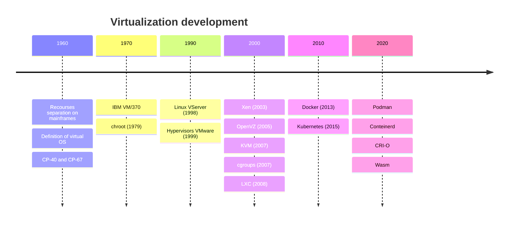
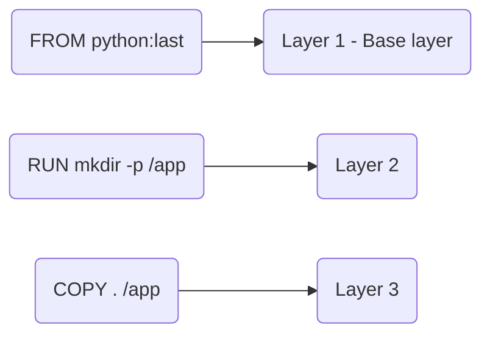
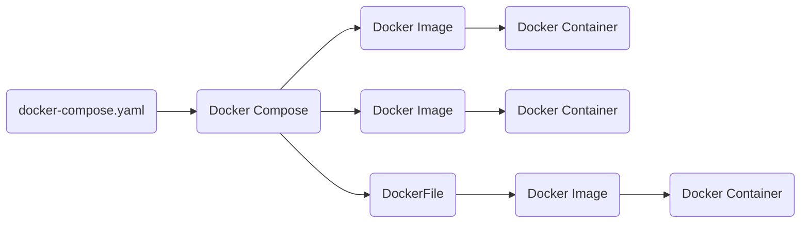

# Application and Dependencies Conteinerization

<!--toc:start-->

- [Application and Dependencies Conteinerization](#application-and-dependencies-conteinerization)

  - [Docker](#docker)
    - [Main Components](#main-components)
    - [`Dockerfile`](#dockerfile)
  - [Docker Compose](#docker-compose)
  <!--toc:end-->

- Different OS versions
  - Development on Windows, serve on Linux
  - Locally works, but not in production
- Dependepcies
  - Different versions
  - Dependencies updates broke the app
- Environment settings
- Monolithic VM



## Docker

- Namespaces
  Environment isolation
- Cgroups
  Allow containers to use shared resources
- UnionFS
  Separation and reusability of layers
- containerd & runC
  - daemon on host-system, which manages container lifecycle
  - library-wrapper for container runtime

### Main Components

- Docker Daemon - manages containers
- Docker CLI - working interface
- Docker Images - container templates
- Docker Containers - running instances of images
- Docker Registry - central repository for container images
- Docker Volumes - shared data between containers (databases, files, etc.)
- Docker Networks - virtual network for containers

### `Dockerfile`

- Instruction for image creation
- Each instruction creates intermidiate image layer
- Final build is done by Docker daemon
- For optimization layers are cached




## Docker Compose



`docker-compose.yaml`

```aml
services:
  service_name
  build:
    context:
    dockerfile: Dockerfile
  container_name:
  restart:
  ports:
  environment:
  volumes:
  depends_on:

volumes:
networks:
```
