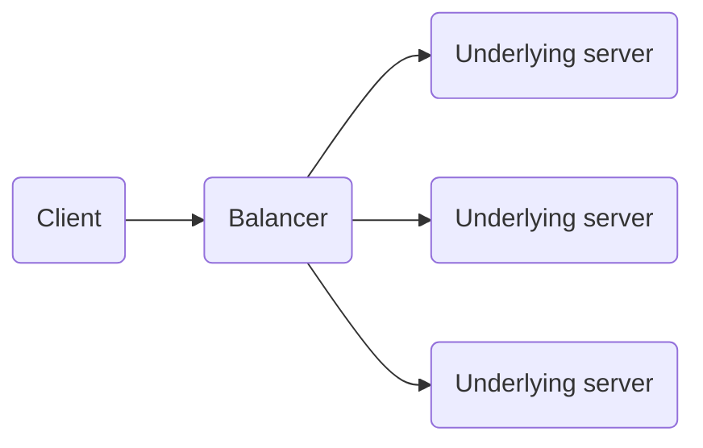

# Application Protocols: gRPC, GraphQL, WebSocker

<!--toc:start-->

- [Application Protocols: gRPC, GraphQL, WebSocker](#application-protocols-grpc-graphql-websocker)
  - [gRPC](#grpc)
    - [Disadvantages](#disadvantages)
  - [GraphQL](#graphql)
    - [Which Problem Does It Solve?](#which-problem-does-it-solve)
    - [What is It?](#what-is-it)
  - [WebSocket](#websocket)
    - [Disadvantages](#disadvantages)
- [When to Use](#when-to-use)
<!--toc:end-->

## gRPC

RPC by itself is solving the problem with data bloat from text data: `XML`, `json`, within RPC (Remote Procedure Call)
we communicate with server remotely as it is local machine that can run our commands.

Google extension on RPC provides Protocol Buffers as the structure for communication: it is binary format that handles
values types and can be used only trhough code generation.

Also, with gRPC we can multplex the requests (one connection for multiple requests) and data streaming - craete
one/two-way data flow

The steps to start working with gRPC are the following:

- Create `.proto` files for models in your project
- Using `protoc` and separate plugins (`protoc-golang`) generate models for your project
- Using `protoc-<language>-grpc` generate structures for gRPC communication

### Disadvantages

- Machine code
  We can not read the protobug without scheme since it is binary
- Uneven load on servers
  Because of multiplexing and streaming, load may go unevenly on machines

## GraphQL

### Which Problem Does It Solve?

- Data Bloat
  - More load on network since of more data
  - More load on serialization/deserialization
  - Dead fields: server returns fields that client does not need
- Lack of Data
  - Dependent requests
  - Aggregative requests

### What is It?

**GraphQL** is a query and manipulation language for APIs and the mechanism to process the requests. GraphQL provides
declarative selection of data, where client may request only what it needs.

## WebSocket

WebSocket is a communication protocol over TCP transport layer (more low-level than previous technologies), used for creation of two-way flow tube.

Data can be trasfered in any format (text, binary), network load becomes lower since each request does need to transfer
headers or context after connection establishment.

WebSocket is supported by browser and can be implemented in any programming language.

### Disadvantages

- To check the fact for connection closing, server should check that client does not respond (`heartbeat`, `ping-pong`)
- All the middle network elements must be _stable_ and support WebSocket (e.g. some proxi does not support it)
- In case of connection lost, server must _return the lost state_

# When to Use

- **SOAP**
  - Legacy systems
  - Protocol requirements (1C)
- **REST**
  - Public interface
  - Classic application
  - Simplicity and flexibility of development
  - Browser compatibility
- **gRPC**
  - High-load microservices
  - Internal services
  - When you need lower latency
  - No need in browser compatibility
- **GraphQL**
  - Hard domen model
  - Flexible and efficient data load
- **WebSocket**
  - Real-time data exchange with low latency
  - gRPC is not suitable or too complex
