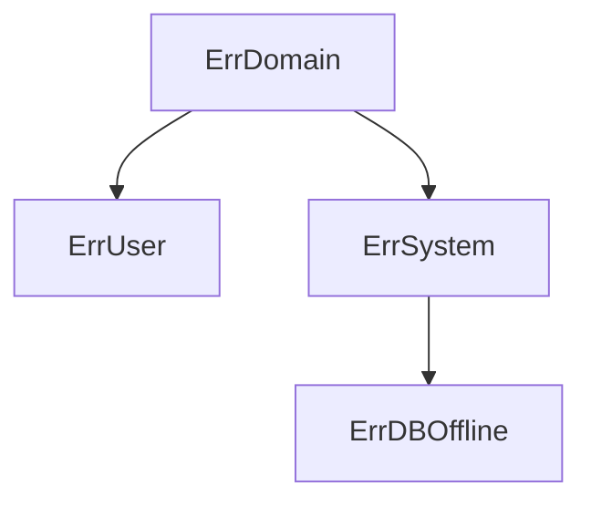

# Errors

## `error` interface

```go
// The error built-in interface type is the conventional interface for
// representing an error condition, with the nil value representing no error.
type error interface {
    Error() string
}
```

By agreement errors in Go are returned from function as last returning value. Also, if the function returns an error, it
do not return any other values

```go
func doSomething() (string, error)
```

## Defining own errors

```go
errors.New("my error") // bad way

type errCustomString string // better, but not quite good

func (e errCustomString) Error() string {
    return string(e)
}

type errCustomStruct struct { // the best variant
    msg string
}

func (e errCustomStruct) Error() string {
    return fmt.Sprintf("custom error: %s", e.msg)
}
```

Some of the best practices:
Take off all of the custom errors to `errors.go` inside the package
Errors are often non-private (names and fields from capital letter)

### Own error type with wrapping

```go
type ErrReadFile struct {
    err error
}
func (e ErrReadFile) Error() stirng {
    return fmt.Sprintf("read file: %s", e.err.Error())
}
func (e ErrReadFile) Unwrap() error { // []error
    return e.err
}
```

### Error handling in `defer`

```go
func readFile(path string) (content string, err error) {
    f, err := os.Open(path)
    if err != nil {
        return "", fmt.Errorf("open file: %w", err)
    }
    defer func() {
        cErr := f.Close()
        if cErr != nil {
            if err == nil {
                err = cErr
                return
            }
            err = errors.Join(err, cErr)
        }
    }()

    buffer := []byte{}
    _, err = f.Read(buffer)

    if err != nil {
        return "", fmt.Errorf("read file: %w", err)
    }

    content = string(buffer)
    return
}
```

## `errors.As()` as analogue to try catch

```go
type ErrorCustom struct {
    Counter int
}
func (e ErrCustom) Error() string {
    return fmt.Sprintf("custom error with counter %d", e.Counter)
}

err := doSmth()
if err != nil {
    // cErr := &ErrCustom{}
    // if errors.As(err, cErr) {
    //     fmt.Println(cErr.counter)
    // }
    if cErr := new(ErrCusom); errors.As(err, cErr) {
        fmt.Println(cErr.counter)
    }
    return fmt.Erorf("undefined error: %w", err)
}
```

Example of bad unprofessional legacy code:

```go

// errors.go

var ErrNoRows = errors.New("no rows in result set")

// main.go

func doSMth() error {
    err := doAnother()
    if err != nil {
        if errors.Is(err, pgx.ErrNoRows) {
            // error handling
        }
        return fmt.Errorf("undefined error: %w", err)
    }
}
```

## Errors in go-routines

```go
func calculate(input <- chan int, err chan<- error) {
    // do something, when new input/error arrives
}

func main() {
    input := make(chan int)
    err := make(chan error)

    go calculate(input, err)

    for i := 0; i < 10; i++ {
        input <- i
        if err := <- err; err != nil {
            close(input)
            return err
        }
    }
}
```

## Error hierarchy



```go
type ErrDomain struct {}

func NewErrDomain() error {
    return ErrDomain{}
}

func (e ErrDomain) Error() string {
    return fmt.Sprintf("")
}

type ErrUser struct {
    err  error
}

func NewErrUser() error {
    return ErrUser{
        err: NewErrDomain(),
    }
}

func (e ErrUser) Error() string {
    return fmt.Sprintf("")
}

func (e ErrUser) Unwrap() error {
    return e.err
}

// func.go

if err != nil {
    if erros.As(err, &ErrDomain{}) {
        if errors.As(err, &ErrUser{}) {
            // handling concrete error
            // example: user errors can be shown in front-end
        }
    }
}
```

## Panic handling

```go
func f() (err error) {
    defer func() {
        if r := recover(); r != nil {
            err = fmt.Errorf("panic: %w", err)
        }
    }()
    panic("hi there")
}
```
