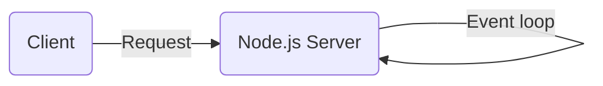
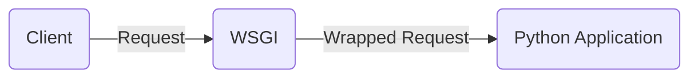
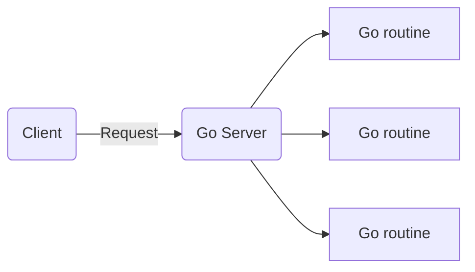

# Server Performance

## JS (`Node.js`, `Express.js`)

- Single-threaded, can process I/O bound operations through regular process switches (`async event loop`)
- It is done with `Promises`: operations are deferred to time I/O is done, so other operations can be taken into account

## Python (`Django`, `Flask`)

_WSGI_: Web Server Gateway Interface - a standard protocol for communication between web servers and web applications

To parallel the requests, WSGI spawns a new python application entity for each one.

## Go

