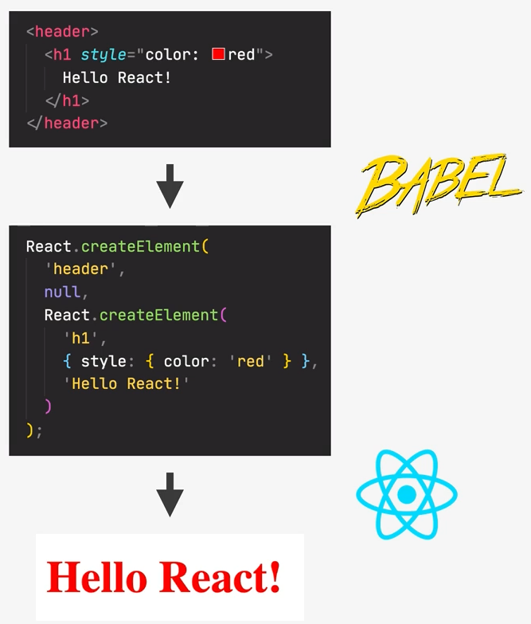

# Building the first application from scratch

First, each builder has its entry point to the application, often it is the `src/index.js` or `src/index.ts`
Also, for modern developing `<React.StrictMode>` is often used, it enables multiple rendering before
drawing element (component) into the user interface

## Components

- React application are entirely made of components
- **Building blocks** of user interface in React
- Piece of UI that has its own **data**, **logic** and **appearance**
- We build complex UIs by **building multiple components** and **combining** them
- Components can be **reused**, **nested** inside each other, and **pass data** between them

> [!NOTE]
> To clearly see the relations between components Component tree is used

## What is JSX?

- **Declarative** syntax to **describe** what component **look like** and **how they work**
- Components must **return** a block of JSX
- Extension of JavaScript that allows us to **embed JavaScript, CSS, and React components into HTML**
- Each JSX element is **converted** to a `React.createElement` function call

Default Vanilla JavaScript approach is **imperative** (_"How to do things?"_)

- Manual DOM element selections and DOM traversing
- Step-by-step DOM mutations until we reach the desired UI

**General JSX rules:**

- Works essentially like HTML, but we can enter "JavaScript mode" using `{}`
- Inside we can place **expressions** (everything, that **returns** a value)
- **Statements** (something, that does not return a value) are **not allowed**

**Differences among the HTML:**

- `className` instead of `class`
- `htmlFor` instead of `for`
- Every tag need to be **closed**
- All event handlers and other properties are in camelCase (_except the `aria-` attributes_)
- Comments need to be in `{}`

## Separation of concerns

Traditionally, there was _one technology per file_: JavaScript for functionality, CSS for styling,
HTML for structure, but as pages got more interactive, JavaScript became **more in charge of HTML**
Since logic and UI are tightly coupled → Why keep them separated? → **React Components** and **JSX**

## Styling variations

1. The simplest method is inline styles, where styles are in camelCase in `style={{}}` attribute
2. CSS, SCSS stylesheets as files, that _must be included into components_
3. Imported component stylesheets as `tailwind` or `bootstrap` working with `className`'s
4. `styled-components`

## Props

Props are used to pass data from **parent components** to **child components (down** the component tree)
It is the essential tool to **configure** and **customize** components (like function parameters)
With props, parent component **controls** how child component look and work
**Anything** can be passed as props: single values, arrays, object, even other components

> [!NOTE]
> Component has two ways for data handling: props and state, where **props** are external data for
> **read-only** operations and state is an internal data that component can modify itself

React uses **one-way** data flow (Angular used **two-way**)

- This makes applications more predictable and easier to understand
- Makes applications easier to debug, as we have more control over the data
- Is more performant

Since props is a single object with elements named as attributes in element, we can easily
destructure it just in component parameters field

## Conditional rendering

> [!IMPORTANT]
> To avoid rendering '0' symbol, we should provide true/false condition (`array.length > 0`)

To reproduce the behavior of `&&` operator with ternary one, we can use `: null`

### React Fragments

React fragments are made for returning the several elements without additional wrapper (`<></>`), but
in case when the fragment should have its key, it is better to use `React.Fragment`
