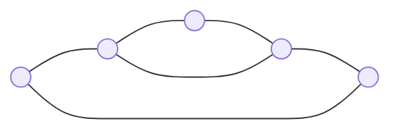

# Networks history

<!--toc:start-->
- [Networks history](#networks-history)
  - [First steps](#first-steps)
  - [General Steps](#general-steps)
  - [Network models](#network-models)
    - [Data Flow](#data-flow)
  - [Physical level](#physical-level)
  - [Кодирование (Encryption)](#кодирование-encryption)
  - [Характеристики](#характеристики)
  - [Медные Кабели](#медные-кабели)
  - [Неэкранированная Витая Пара (UTP)](#неэкранированная-витая-пара-utp)
  - [Оптоволоконный Кабель](#оптоволоконный-кабель)
<!--toc:end-->

## First steps

> Main idea is to connect computers to each other (straightforward or through retranslators)

- 1950-1960: first attemprs to associate mainframes with terminals
- 1969: ARPANET, the first network, using phone lines to transmit data
- USA government makes a decision to combine all the supercomputers in the country into a single network

## General Steps

As for now, we are still using the technology of the 70s, approximately the time when Ethernet become similar to what we have now.

Schemas of the networks are becoming more and more complex, but the main idea is still the same: connect computers to each other. There is no the best way to do it, each one has its own advantages and disadvantages, the main differences become from price.

- 1991: web protocol and sites appear
- 1995-2000: development of the web, computers become more popular
- 2000-2010: using of wireless networks, the price to transfer data decreases significantly

From 90s we get the same overall idea, but the main characteristics, protocols are from 2010s.

## Network models

- OSI - The Open Systems Interconnection model (standard ISO/IEC 7498). Network model for stack of protocols.
- Etalon model
- Did not get popular because of close development, issues in implementing and late appierance

OSI model of the network:

Functional/Microservices model of the network:

### Data Flow

- Incapsulation: process to add headers to the data on each level from 7 to 1
  On the 1st level data converts to binary and transmits through the wire
- Decapsulation: reverse process

## Physical level

- Чтобы получить возможность передавать данные, в первую очередь необходимо установить физическое соединение с локальной сетью
- Подключение может быть проводным или беспроводным, в зависимости от настройки сети
- Сетевые интерфейсы (Network Interface Card, NIC) - устройства, которые позволяют компьютеру подключаться к сети
- Некоторые устройства могут иметь только один интерфейс, другие - несколько
- Не все физические подключения обеспечивают одинаковую скорость передачи данных

Физический уровень отвечает за скорость передачи данных, задержку и вероятность потери данных.

## Кодирование (Encryption)

Кодирование - это просто метод оптимализации передачи данных, чтобы уменьшить количество ошибок.

## Характеристики

- Полоса пропускания (Bandwidth) - максимальное количество данных, которое может быть передано через канал связи за единицу времени
- В цифровых сетях под пропускной способностью понимается объем данных, который может быть передан через канал связи за единицу времени; сколько бит может быть передано за секунду
- Задержка (Latency) - количество времени, которое требуется для передачи данных от отправителя к получателю
- Пропускная способность (Throughput) - количество битов, передаваемых по среде за определенный период времени
- Полезная пропускная способность (Goodput) - количество полезных данных, передаваемых по среде за определенный период времени
  Goodput = Throughput - Overhead (например, заголовки пакетов)

## Медные Кабели

Медный кабель является наиболее распространённым типом кабелей, используемых для передачи данных в локальных сетях.

**Ограничения:**

- Затухание - чем дольше должны идти электрические сигналы, тем слабее они становятся
- Электрический сигнал чувствителен к помехам от других источников, которые могут искажать и повреждать сигналы данных (электромагнитные помехи (EMI), радиочастотные помехи (RFI), перекрёстные помехи (crosstalk))

**Устранение:**

- Строгое соблюдение предельных значений длины кабеля позволит уменьшить затухание
- Некоторые виды кабелей смягчают EMI и RFI с помощью металлического экранирования и заземления
- Некоторые виды кабелей могут смягчить перекрестное наложение сигнала путем скручивания противоположных пар проводов цепи вместе

## Неэкранированная Витая Пара (UTP)

- Наиболее распространённый тип кабеля для локальных сетей
- Содержит 4 пары проводов, каждая из которых скручена вместе
- Оснащены разъемами RJ-45
- Соединяют хосты с промежуточными устройствами

## Оптоволоконный Кабель

Оптоволоконный кабель - это кабель, содержащий один или несколько волокон, каждое из которых состоит из очень тонкого стеклянного или пластикового волокна

- Идеально подходит для некоторых сетевых сценариев
- Позволяет передавать данные на бОльшие расстояния и с более высокой скоростью
- Менее восприимчивы к затуханию и полностью невосприимчивы к электромагнитным помехам
- Использует лазер или светодиод для кодирования битов как импульсы света
- Действует как световод, который направляет свет через волокно
