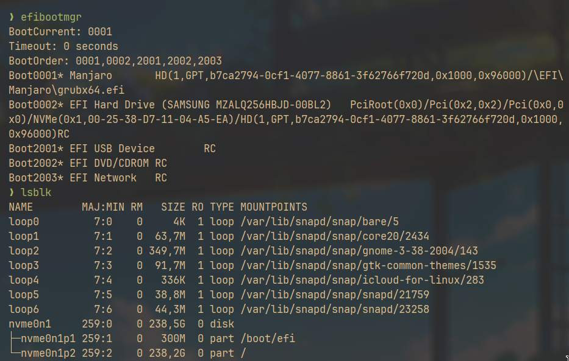
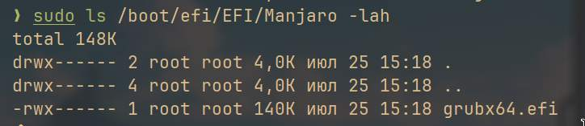

# Lab 1. Introducing to Linux and OS main components.

## Introducing to Linux.

### What is your machine hostname, how did you check it?

`mashfeii-laptop`

### What is the difference between `/bin/bash` and `/bin/sh`?

- `bash` is the most common shell on Linux distributives today, it is build on top of `sh` providing more functionality,
  features, but with backward compatibility.
- Often, `/bin/sh` is just a symbolic link to another shell like `dash` or `bash`
- `/bin/bash` is not POSIX valid, while `/bin/sh` is.

### Explain all the details of the output from the command `uname -a`?

- `uname` is a command that returns system information.
- `uname -a` is a command that returns all the details of the system in the following order:
  - Kernel name
  - Hostname (network node hostname)
  - Kernel release
  - Kernel version
  - Machine hardware name
  - Operating system

### What command typically shows you the manual for POSIX compliant tools on the Linux operating system?

`man` command, for example:

- `man <command>` is used to display user commands manual.
- `man 3p <command>` is used to display POSIX Programmer's Manual.
- `man 3 <command>` is used to display Library Functions Manual.

## GPT

### What is `fdisk` is used for?

`fdisk` is used for creation and manipulation of disk partition tables (table that contains records of divisions of block devices into logical disks).

### Show the bootable device(s) on your machine, and identify which partition(s) are bootable.

- `efibootmgr` - show UEFI booting information
- `lsblk` - show all available block devices
- `fdisk -l` - display partitions

From the output we see, that `nvme0n1` is bootable disk, where `nvme0n1p1` stands for EFI partition and `nvme0np2` - for Linux system.

### What is logical block address?

Logical block address is a unique number that is used to identify a specific block of data in the storage device. Such approach is used to abstract the physical layout of the storage and improve the speed of data access. (Often, to get physical address from logical one, there is a translation layer in storage system)

### Why did we specify the `count`, the `bs`, and the `skip` options when using `dd`?

- First, we knew where to find master boot record, that's why we limited search size by `count` and `bs`
- Second, we get information about where to search GPT headers, so we left the size the same, but skip first LBA by setting `skip` option

### Why does a GPT formatted disk have the MBR?

The main reason is backward compatibility, since MBR is a legacy bootloader that is used by many operating systems. Also, it can be useful if GPT data is corrupted.

### Name two differences between primary and logical partitions in an MBR partitioning scheme

1. Number of primary partitions is limited to 4.
2. Only primary partitions are bootable.

## UEFI Booting

### Why Shim used to load the GRUB bootloader?

Shim is a small pre-signed preloader that is used to validate sign or hash of the next loading file. Since GRUB can not be signed (because of Microsoft licensing), Shim is used to load and verify other bootloaders (e.g. GRUB).

### Can you locate your grub configuration file? Show the path.

`/boot/efi/EFI/Manjaro/grubx64.efi`

### According to the boot order, what is the third boot device on your computer? How did you check this?

EFI USB Device
