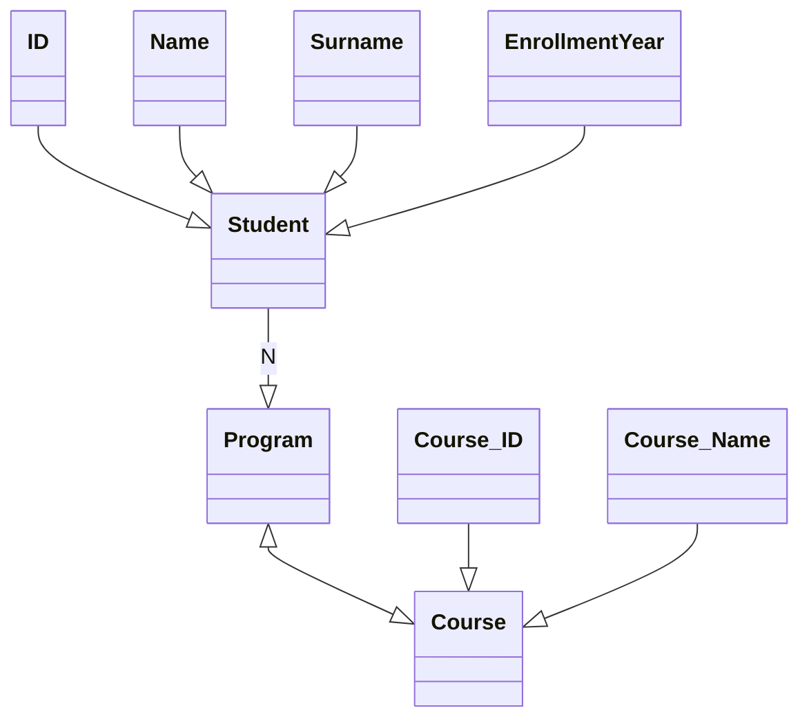

# Система ебана

- Студент не может существовать без курса
- Когда курс завершен, ставится оценка
- Оценка в процентах/буквах
- Какие поля есть у курса?
  Айди, название, год начала
- Программы состоят из одного или нескольких курсов
  Айди, имя, год рекомендования

